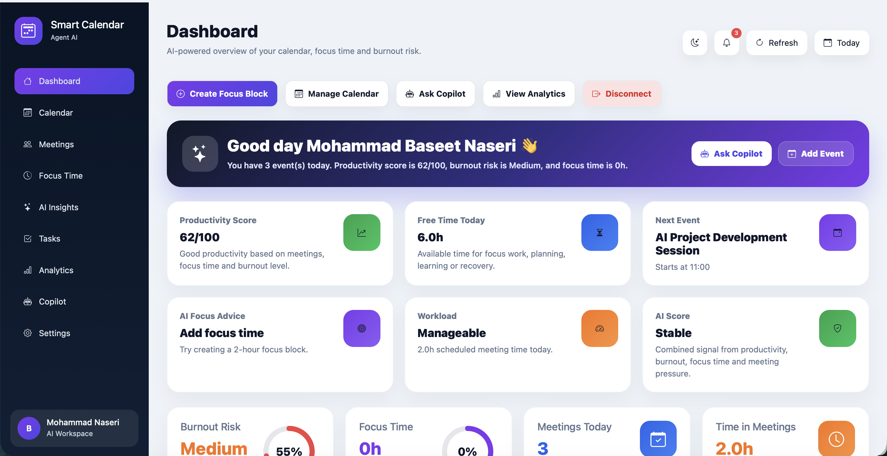
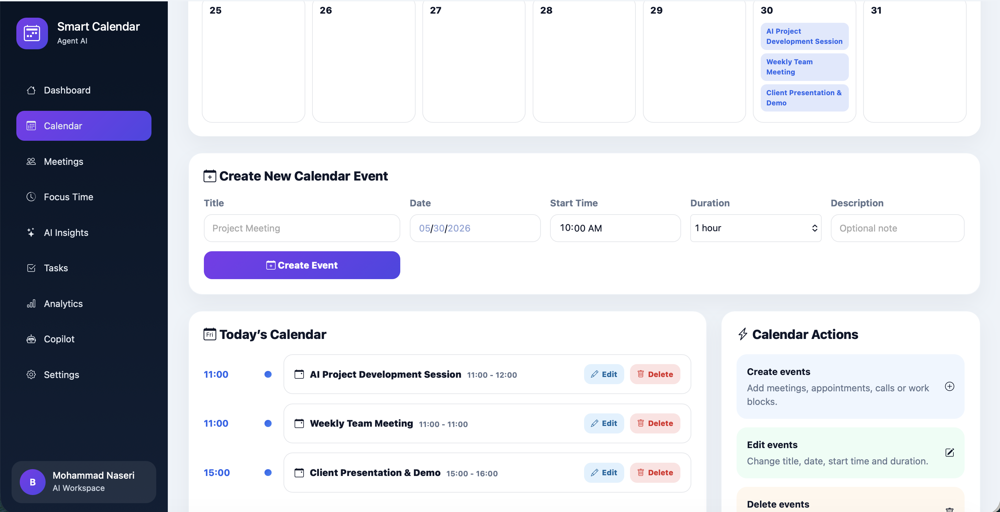
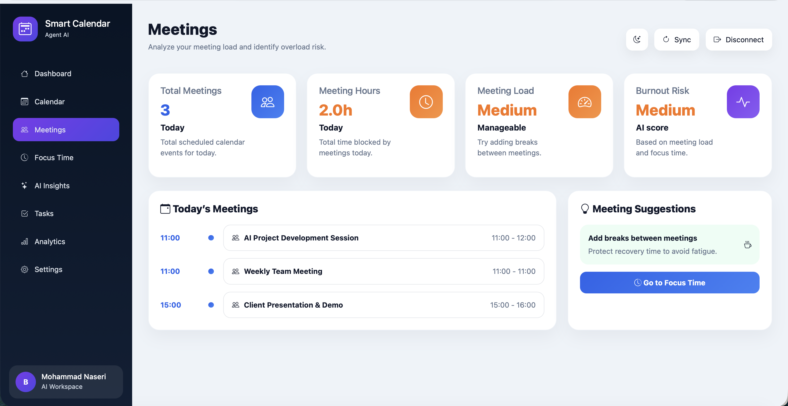
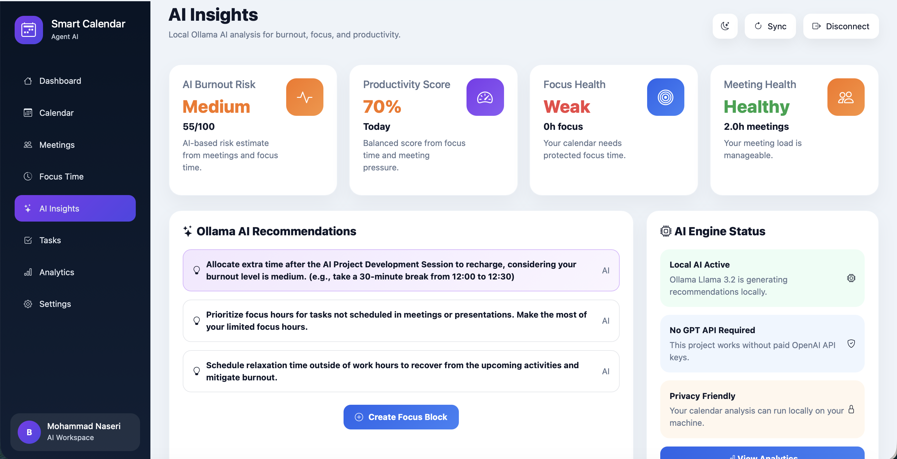
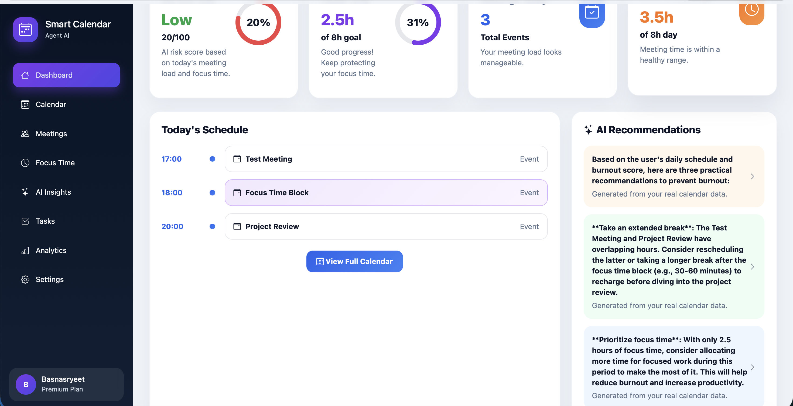
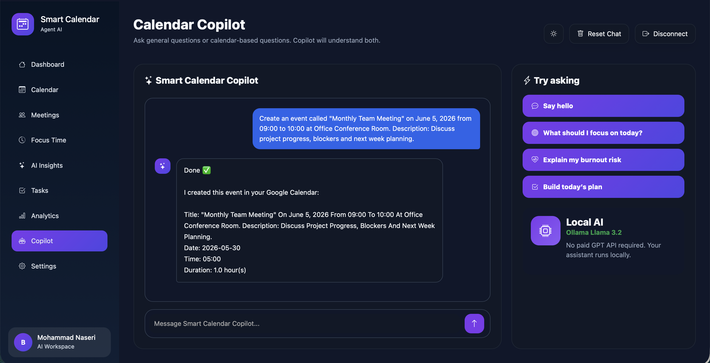
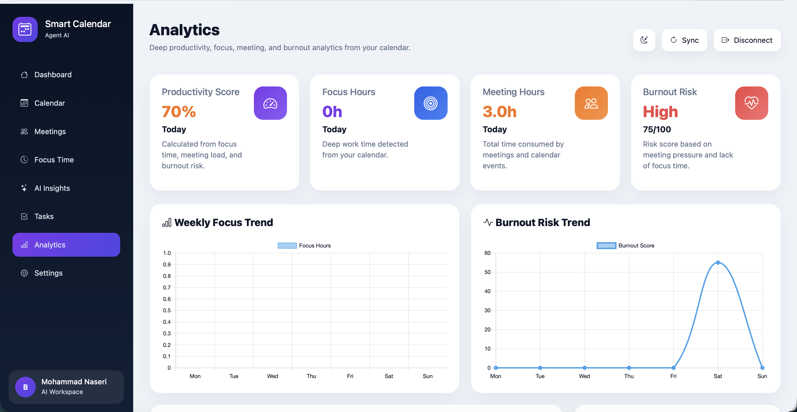

# Smart Calendar Agent AI 

AI-Powered Calendar Management, Productivity Analytics & Local AI Copilot built with Flask, Google Calendar and Ollama.

Smart Calendar Agent AI transforms a traditional calendar into an intelligent productivity assistant that helps users manage meetings, protect focus time, reduce burnout risk and improve daily productivity.

---

##  Overview

Smart Calendar Agent AI combines:

- Google Calendar Integration
- AI Copilot Assistant
- Burnout Risk Detection
- Focus Time Planning
- Productivity Analytics
- Smart Recommendations
- Dark / Light Mode
- Modern SaaS Dashboard

The goal is to help users maintain a healthy balance between meetings, deep work and productivity.

---

# Screenshots

## Dashboard



---

## Calendar



---

## Meetings



---

## AI Insights



---

## AI Recommendations



---

## AI Copilot Chat



---

## Analytics & Charts



---

#  Features

## AI Copilot Assistant

- ChatGPT-style interface
- Powered by Ollama Local AI
- Calendar-aware conversations
- Productivity recommendations
- Scheduling assistance

---

## Google Calendar Integration

- Secure OAuth Authentication
- Real-time Calendar Synchronization
- Create Events
- Update Events
- Delete Events
- Focus Block Creation

---

## Burnout Risk Analysis

- Meeting Load Analysis
- Focus Time Tracking
- Burnout Score Calculation
- Burnout Level Classification
- AI Recommendations

---

## Focus Time Planner

- Deep Work Blocks
- Productivity Protection
- Smart Scheduling
- Focus Goal Tracking

---

## Analytics Dashboard

- Weekly Analytics
- Productivity Metrics
- Burnout Trends
- Interactive Charts
- Calendar Insights

---

## Smart Recommendations

- Personalized Productivity Advice
- Burnout Prevention Suggestions
- Focus Time Recommendations
- Calendar Optimization

---

## Modern UI

- Responsive Design
- Dark Mode
- Light Mode
- Premium Dashboard Layout
- Modern SaaS Experience

---

# Technology Stack

### Backend

- Python
- Flask
- Google Calendar API
- OAuth 2.0

### AI Layer

- Ollama
- Llama 3.2
- Local AI Processing

### Frontend

- HTML5
- CSS3
- Bootstrap 5
- JavaScript

### Data Visualization

- Chart.js

---

# Project Structure

```text
Smart-Calendar-Agent-AI/
│
├── app.py
├── auth.py
├── analytics.py
├── calendar_utils.py
├── config.py
├── ollama_ai.py
│
├── templates/
│   ├── index.html
│   ├── calendar.html
│   ├── meetings.html
│   ├── focus.html
│   ├── ai_insights.html
│   ├── analytics.html
│   ├── copilot.html
│   ├── tasks.html
│   └── settings.html
│
├── static/
│   ├── css/
│   └── js/
│
├── screenshots/
│
├── requirements.txt
├── .env.example
├── README.md
└── .gitignore
```

---

# Installation (macOS)

### Clone Repository

```bash
git clone https://github.com/baseetnaseri6/Smart-Calendar-Agent-AI.git
cd Smart-Calendar-Agent-AI
```

### Create Virtual Environment

```bash
python3 -m venv .venv
```

### Activate Environment

```bash
source .venv/bin/activate
```

### Install Dependencies

```bash
pip install -r requirements.txt
```

### Run Application

```bash
python app.py
```

Open:

```text
http://127.0.0.1:5001
```

---

# Installation (Windows)

### Clone Repository

```bash
git clone https://github.com/baseetnaseri6/Smart-Calendar-Agent-AI.git
cd Smart-Calendar-Agent-AI
```

### Create Virtual Environment

```bash
python -m venv .venv
```

### Activate Environment

```bash
.venv\Scripts\activate
```

### Install Dependencies

```bash
pip install -r requirements.txt
```

### Run Application

```bash
python app.py
```

---

# Environment Variables

Create a `.env` file using:

```env
FLASK_SECRET_KEY=your_secret_key_here

GOOGLE_CLIENT_SECRETS_FILE=client_secret.json

GOOGLE_REDIRECT_URI=http://127.0.0.1:5001/oauth2callback

OPENAI_API_KEY=your_api_key_here
```

You may replace AI providers, models or integrations according to your own requirements.

---

# AI Capabilities

The platform can:

- Analyze meeting schedules
- Detect burnout risk
- Generate productivity insights
- Recommend focus sessions
- Optimize calendar planning
- Interact through AI Copilot

All AI processing can run locally using Ollama.

---

# Future Roadmap

Planned improvements:

- AI Task Manager
- Smart Meeting Scheduler
- Automatic Focus Optimization
- PDF Productivity Reports
- Multi-Calendar Support
- Team Collaboration
- Mobile Version
- Advanced AI Planning Agent

---

# Why This Project?

Modern professionals spend a significant portion of their day managing calendars, meetings and tasks.

Smart Calendar Agent AI helps users:

- Protect Focus Time
- Reduce Meeting Overload
- Prevent Burnout
- Improve Productivity
- Make Better Scheduling Decisions

---

# Author

**Mohammad Baseet Naseri**

- AI & Data Science Enthusiast
- AI Engineer
- Full-Stack Developer
- AI Project Builder

---

# License

This project is licensed under the MIT License.
